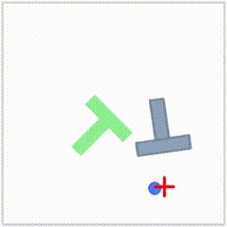
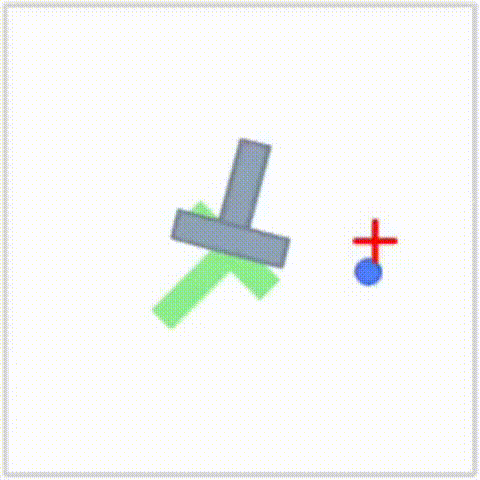

# Push-T Imitation Learning

## 成果展示

### Behavior Cloning



### Flow Matching




## Setup

This project uses `uv` for package management. `uv` is a Python package and environment manager from [Astral](https://astral.sh). It replaces tools like
`pip`, `pipx`, `conda`, and `virtualenv` with a single, simple interface. It is also much faster than prior tools.

### Installing `uv`

Run the following in your terminal:

```bash
curl -LsSf https://astral.sh/uv/install.sh | sh
```

After installation, open a new terminal so `uv` is on your `PATH`.

### Always use `uv run`

Do **not** run `python` or `pip` directly. Always run scripts through `uv run` so dependencies
and environments are handled automatically. If you want to add a new dependency, you can use `uv add`. This will add the dependency to `pyproject.toml`, update `uv.lock`, and install the package into your virtual environment.

Example:

```bash
uv run src/push_t_imitation/train.py --help
```

This should work out of the box with the current codebase.

## Weights & Biases (wandb) login

This project uses [Weights & Biases (WandB)](https://wandb.ai) for experiment tracking. WandB is a tool for logging and visualizing machine learning experiments. It is free for academic use. Before running a training script, you will need to log in to WandB using your API key.

```bash
uv run wandb login
```

